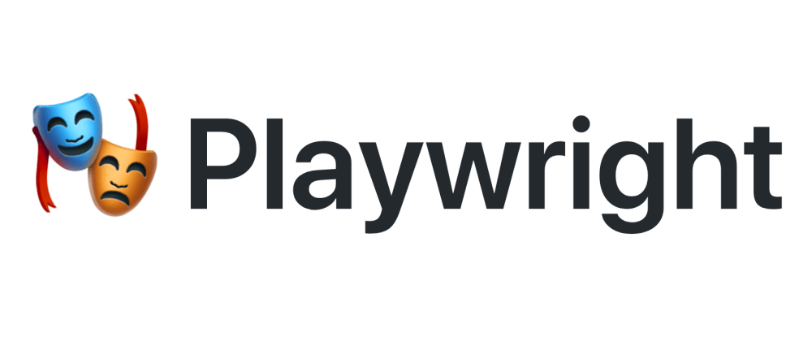

<h1>Kickstarter for the Playwright Test Runner</h1>

* [Install](#install)
* [How to Use](#how-to-use)
* [Tests](#tests)
* [Configuration](#configuration)
* [GitHub Actions](#github-actions)

This repository teaches how to use [**Playwright**][pw] and its test runner (`@playwright/test`) in a fresh React + Vite front-end application.

## Install

1. Fork and clone the repository
1. Run `yarn` to install dependencies
1. Run `yarn build` to build the application

## How to Use

You can either use this repository as a template for your next project or copy over the relevant parts. Playwright is simple enough to migrate between projects as it only needs one configuration file and pipeline definitions.

## Tests

Test suites live inside the `tests/` directory. As this is a starter repository, they only test the landing page of the provided Vite application.

The two tests are structured as follows:

* `counter.spec.ts` tests the clickable counter on the main page
* `landing.spec.ts` tests the visuals of the landing page with snapshot tests

Tests are structured in the popular BDD syntax and use the _Given/When/Then_ pattern.

You can run the end-to-end tests with `yarn test:e2e`. Add flag `--help` to see all the possibilities.

Separate script `yarn test:debug` allows to use Playwright's step debugger for more information on how your tests behave. The debugger implicitly disables test timeout and parallel workers for easier troubleshooting.

## Configuration

Playwright configuration lives [here](./playwright.config.ts). Feel free to tinker and experiment with different [options][options].

## GitHub Actions

Each push runs a full test-suite across multiple browsers and operating systems. Traces from failed tests and the overall test report are uploaded as artifacts and stored for seven days.

[pw]: https://playwright.dev
[options]: https://playwright.dev/docs/test-advanced#configuration-object
